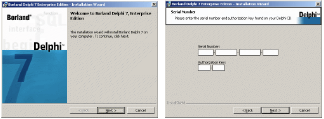

# Delphi 7的安装与卸载

在安装 Delphi 7 之前，请检查一下软硬件的配置是否符合以下要求。
- Pentium 166 以上的个人计算机，推荐使用 Pentium 333 以上。
- 32MB 以上的内存，推荐使用 64MB 以上。
- Delphi 7 的紧凑安装需 100MB 以上的硬盘空间。
- VGA 或更高分辨率的显示器。
- Windows 9x、Windows NT/2000/XP 或更高版本的操作系统。

Delphi 7 总共有 3 个版本，以供不同的用户使用。
- 标准版（Standard 版）：面向刚入门或不经常使用的用户。
- 专业版（Professional 版）：面向专业的程序员。它包括了基本特征以及扩展的数据库编程支持，
一些 Internet 支持与一些外部工具。
- 企业版（Enterprise 版）：面向开发大型应用程序的程序员。
现在，以在 Windows XP 中文版操作系统下安装 Delphi 7 企业版（Enterprise 版）为例，来介绍一下 Delphi 7 的安装过程。

## Delphi 7 的安装

- （1）在 Windows XP 下，将 Delphi 7 企业版安装光盘放入光驱中，系统将自动弹出 Delphi 7 的欢
迎界面，如图 1-1 所示。
- （2）单击“Next”按钮，安装向导提示用户输入序列号（Serial Number）以及授权码（Authorization 
Key），如图 1-2 所示。相关信息可以在说明书或软件包装上找到，也可在根目录下的相关文件中查找。

  

- （3）输入正确的序列号后，单击“Next”按钮进入下一步，此窗口将显示安装 Delphi 7 时所需的
软件许可协议，如图 1-3 所示。如果用户同意，单击“Next”按钮进入下一步。
- （4）安装向导提示用户有关 Delphi 7 的详细信息，请用户仔细阅读，以备后用，如图 1-4 所示。

- （5）单击“Next”按钮，进入 Delphi 7 常见的几种安装形式的选择窗口，如图 1-5 所示。
  - 典型安装（Typical）：安装用户最常用的部分，建议大多数用户选用此项。
  - 紧凑安装（Compact）：仅安装 Delphi 7 的最基本部分，在用户硬盘空间有限的情况下，可以选
择此项，但这将缺少很多有价值的功能。
  - 自定义安装（Custom）：安装程序将以对话的形式要求用户按自己的需要选择安装 Delphi 7 的
组成部分，高级用户可以选择此项。
这里选择的是典型安装（Typical），单击“Next”按钮进入下一步。
- （6）安装向导向用户询问是否支持 VisiBroker/CORBA，如图 1-6 所示。本例按照默认选项进行，
单击“Next”按钮进入下一步。

- （7）接下来需要选择安装并注册微软公司的 Office 组件，如图 1-7 所示。
- （8）选择与当前计算机中的 Office 版本的对应项后，单击“Next”按钮将出现安装附加组件的
窗口，如图 1-8 所示。在此建议用户使用默认设置。

- （9）单击“Next”按钮，如图 1-9 所示，安装向导提示 Delphi 7 的默认安装路径。单击“Change”
按钮可以选择安装目录，也可在编辑框中直接输入，在此建议用户采用默认路径。
- （10）单击“Next”按钮，安装向导询问是否将安装数据库保存到本地硬盘，如图 1-10 所示。
  > 在卸载 Delphi 7 时，会用到安装数据库，如果选择将安装数据库保存到硬盘上（约 5MB），就不
需再将光盘插入光驱中了，建议选择此项。

- （11）单击“Next”按钮，出现准备安装 Delphi 7 的窗口，如图 1-11 所示。如果需要修改以前的
设置，可以单击“Back”按钮返回到以前的对话框修改设置选项。
- （12）单击“Install”按钮，正式开始安装 Delphi 7，如图 1-12 所示。在此期间用户可以随时单
击“Cancel”按钮终止 Delphi 7 的安装。
- （13）安装过程中，系统将自动进行程序各个部分的配置，配置完成后，系统显示安装完毕的对
话框，如图 1-13 所示。
- （14）单击“Finish”按钮，系统询问用户是否重新启动计算机，如图 1-14 所示。用户可根据需要继续进行。
  > 至此，Delphi 7 的安装过程全部结束。用户即可在“开始”菜单中启动 Delphi 7。

## Delphi 7 的卸载

当需要卸载 Delphi 时，不能直接将 Delphi 文件夹删除，而需要通过使用控制面板中的“添加或删
除程序”选项来卸载 Delphi 7。只有通过这种方法才能将 Delphi 彻底卸载，操作步骤如下。
- （1）从“我的电脑”或者“开始”菜单中打开“控制面板”，如图 1-15 所示。
- （2）从“控制面板”中选择“添加或删除程序”选项，双击该图标弹出如图 1-16 所示的对话框。
- （3）从对话框中选择“Borland Delphi 7”项，单击“删除”按钮，则会弹出如图 1-17 所示的“添
加或删除程序”提示框。
- （4）单击“是”按钮，弹出如图 1-18 所示的“正在删除”对话框。删除 Delphi 7 需要一段时间，
后面的工作不需要人工干涉，系统即可自动将 Delphi 7 完全从计算机中卸载。